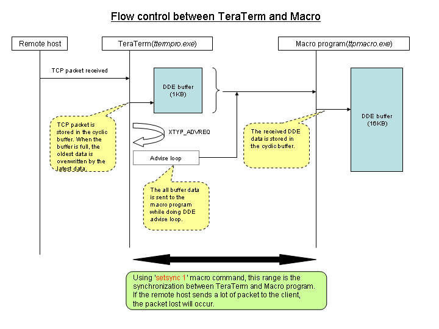

<!-- Generated by docs/macro/generate.py from Tera Term 827a35b050c974b0fdf2a77ef73ed882301eb6c4; do not edit. -->

> Compatibility reference derived from Tera Term. TTL syntax and command behaviour apply to Sterna; executable and UI instructions describe upstream.

# setsync

Sets the synchronous mode.

```ttl
setsync <sync flag>
```

## Remarks

Enters the synchronous communication mode if &lt;sync flag&gt; is non-zero, or enters the asynchronous communication mode if &lt;sync flag&gt; is zero.

Tera Term transfers received characters from the host to MACRO. MACRO stores the characters in the buffer.
The character-reading commands, such as the "[wait](wait.md)" command, read out the characters from the buffer.

Initially, MACRO is in the asynchronous mode. In this mode, the buffer may overflow if no character-reading command is executed for a long time, or the receiving speed is too fast.
In the synchronous mode, the buffer never overflows. If the buffer becomes full, Tera Term stops receiving characters from the host and stops transferring them to MACRO. When the buffer regains enough space,Tera Term restarts receiving and transferring.
Enter the synchronous mode only when it is necessary and re-enter the asynchronous mode when the synchronous operation is no longer needed.

For a macro operation, which requires reliability, something like processing lines of received characters without loss of data, you need to enter the synchronous mode. However, the synchronous mode makes Tera Term slow in speed of receiving characters and causes Tera Term freeze if no character-reading command is executed for a long time.
On the other hand, a simple macro operation, such as auto login, works with almost no problem in the asynchronous mode, because the buffer size is large enough (16K bytes) and all received characters are processed by character-reading commands before the buffer overflows.



## Example

```ttl
connect server
; enter the synchronous mode
setsync 1
timeout = 60
waitln '+OK' '-ERR'

; enter the asynchronous mode
setsync 0

end
```

```ttl
connect '/C=1'

setsync 1

while 1
  ; Request data
  sendln  'REQ'

  ; Delay for 1 second
  pause 1

  flushrecv
endwhile
```

## See also

- [flushrecv](flushrecv.md)
